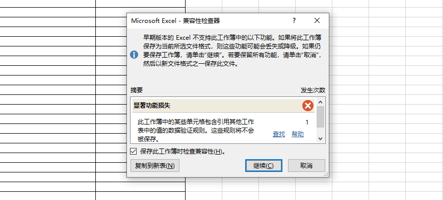
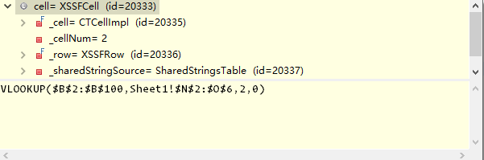

# POI-EXCEL-VLOOKUP
POI解析VLOOKUP函数

### 1.POI获取excel时，VLOOKUP函数解析出来的是公式而不是值

#### （1）.xls和xlsx文件的兼容性问题

用POI的HSSFWorkbook获取xls文件不足以解决现在项目的问题，它只支持老版本的excel文件，由于excel（xls文件）的<u>**下拉框**有兼容性问题</u>，只能用新版的EXCEL2007版本以上，它支持下拉框。



#### （2）xlsx不支持解析，出现空指针异常问题

我把原来的xls文件另存为xlsx文件（此处有严重的伏笔），然后我点击文件上传，文件流到后台之后 new XSSFWorkbook这一步就会出现空指针问题，这也是苦恼了我一下午。

```java
Workbook xwb = null; 
if(".xls".equals(fileType)){
	xwb = new HSSFWorkbook(fis);
}else if(".xlsx".equals(fileType)){
	xwb = new XSSFWorkbook(fis);
}
```

我将new XSSFWorkbook(fis)单独ty catch了一下,之后用inputStream和fileStream等等等等，都踩过坑之后，还是空指针异常，我怀疑是我获取流的方式有问题，我是用request获取的，又又又为零，只能换回来（request的方式）,我用写死路径的EXCEL试了试

```java
String fis = "D:\\222.xlsx"

xwb = new XSSFWorkbook(fis);
```

竟然莫名其妙的上传成功了。然后我将我原来的xlsx里面的文件内容一项一项拷贝到了222.xlsx中，第一次没加下拉框，只有文本数据，发现可以读取到

第二次，加了下拉框，还是可以读取到，我将问题归结到了是VLOOKUP函数导致空指针异常的问题，然后我又将VLOOKUP函数放在了222.xlsx文件中，发现还是可以上传成功。找到了问题的所在，原来是刚开始xls文件另存为xlsx文件的时候，xls文件已经有问题了，导致另存为的xlsx文件也有问题

#### （3）VLOOKUP函数解析出来是公式的问题

终于成功了，当看到bo里面的获取到的值是VLLOOKUP的时候，我已经失去耐心了，也是今天早上回来才成功解析出来的。

昨天在同事和自己的努力研究下，没起到任何的作用，也是查了网上的帖子，看到各样的解决方式

```java
switch (cell.getCellType()) {
	case XSSFCell.CELL_TYPE_STRING: 
		value = cell.getStringCellValue();
		break;
	case XSSFCell.CELL_TYPE_NUMERIC:
		value = nf.format(cell.getNumericCellValue());
		break;
	case XSSFCell.CELL_TYPE_FORMULA:
		value = String.valueOf(cell.getCellFormula());
		break;
	default:
		value = cell.toString();
}
```

`XSSFCell.CELL_TYPE_FORMULA`是公式类，`cell.getCellFormula()`是解析VLOOKUP函数的方法，走断点是可以走到这个`case`里面的，但是`value`还是下面这样。



很头疼的又试了好多方法，都不行。去google上发现一篇有用的帖子。直接粘出来了。

```java
switch (cell.getCellType()) {
	case XSSFCell.CELL_TYPE_STRING: 
		value = cell.getStringCellValue();
		break;
	case XSSFCell.CELL_TYPE_NUMERIC:
        value = nf.format(cell.getNumericCellValue());
        break;
	case XSSFCell.CELL_TYPE_FORMULA:
        value = GetString(cell);
        break;
	default:
        value = cell.toString();
}
```

`getString(cell)`就是最终的解决解析VLOOKUP函数的方法。

```java
private static String GetString(Cell cell) {
        String val = "";
        try {
            val = String.valueOf(cell.getStringCellValue());
        } catch (IllegalStateException e) {
            val = String.valueOf(cell.getNumericCellValue());
        }

        if (val.indexOf("E") > -1) {//防止科学计数法  防止数字变成科学记数法
            DecimalFormat df = new DecimalFormat("0");
            val = df.format(cell.getNumericCellValue());
        }

        return val;
    }
```

其中当然还遇到了很多坑，就不一一说了，一个前端开发工程师。。。

